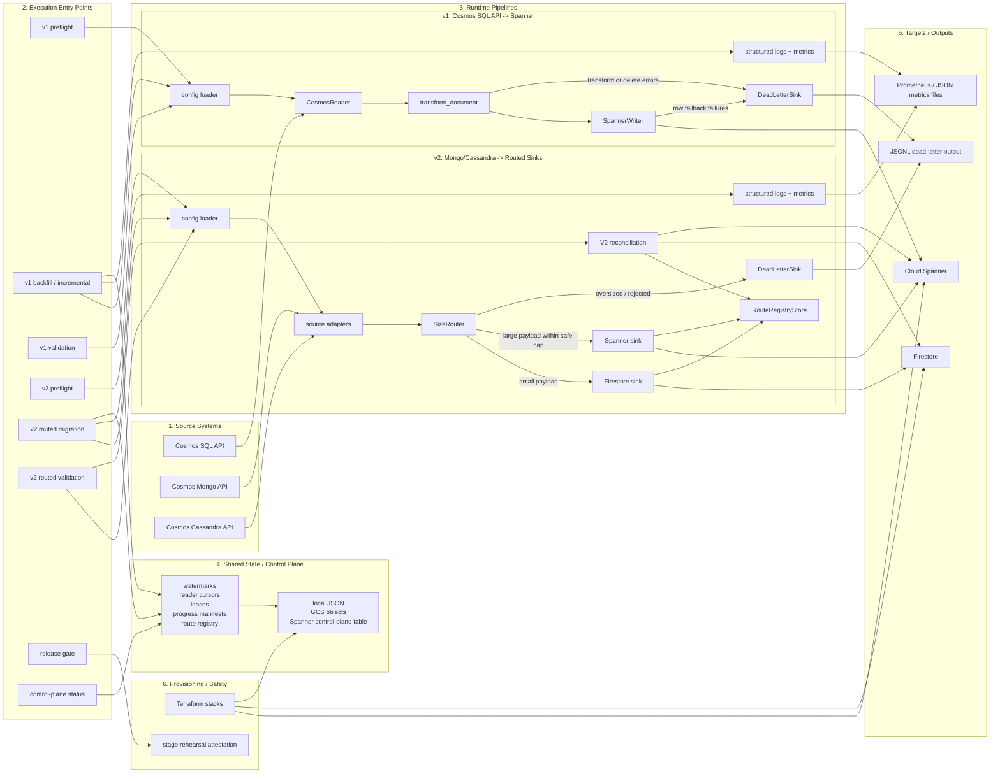

# 12 - Detailed Architecture Diagram

This diagram is the authoritative high-level architecture view for the repository as it exists today.

It keeps the layout simple by separating the system into four layers:

1. source systems
2. execution entry points
3. runtime pipelines
4. state and target systems

## Notes

1. `v1` and `v2` are intentionally separate execution paths. `v1` does not use the size router or Firestore.
2. `v1` incremental checkpoints are keyed by mapping and shard, not only by source container.
3. `v2` route registry entries are richer than simple ID mapping; they capture destination, checksum, payload size, and cleanup state.
4. Shared state can live locally, in GCS, or in a Spanner control-plane table depending on deployment maturity.
5. Distributed execution is coordinated through leases, progress manifests, and reader cursors rather than through in-memory worker state.
