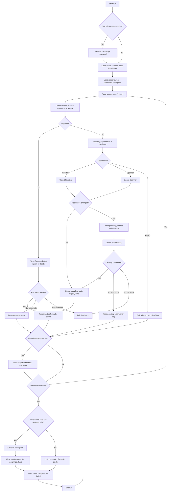

# 13 - Detailed Data Flow Diagram

This diagram focuses on runtime correctness, not every implementation detail.

It shows the five decisions that matter operationally:

1. release gating
2. distributed shard ownership
3. safe source resume
4. write / route / cleanup behavior
5. checkpoint advancement rules

## Notes

1. Reader cursors are persisted only after a known-safe point, not for every source read.
2. Checkpoints advance only when the corresponding writes are confirmed safe.
3. In `v2`, route changes are durable before cleanup so reruns can reconcile interrupted moves.
4. In incremental `v2`, out-of-order records intentionally block checkpoint movement to avoid silent data loss.
