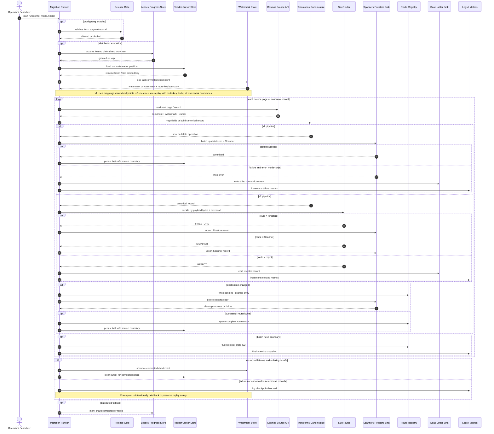

# 13 - Detailed Data Flow Diagram

This sequence diagram captures the runtime behavior that matters most for correctness:

1. release gating
2. distributed lease / shard handling
3. restart-safe reader cursors
4. success-aware checkpoint advancement
5. v2 route-registry move semantics

## Notes

1. Reader cursors are persisted only after a known-safe point, not for every source read.
2. Checkpoints advance only when the corresponding writes are confirmed safe.
3. In `v2`, route changes are durable before cleanup so reruns can reconcile interrupted moves.
4. In incremental `v2`, out-of-order records intentionally block checkpoint movement to avoid silent data loss.
